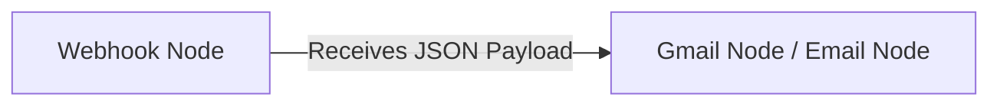

# 🚀 24/7 Cloud Automated Setup via GitHub Actions & n8n

This guide walks you through setting up your LinkedIn Easy Apply Bot to run automatically in the cloud **every day at 9:00 AM IST (even when your PC is turned off)** and send you an email via **n8n** upon completion.

---

## 📌 Step 1: Encode Your Local `state.json` to Base64

Because GitHub Actions runs on a clean server each time, it needs your saved LinkedIn login session (`state.json`).

Run this command in PowerShell inside your project folder:

```powershell
[Convert]::ToBase64String([System.IO.File]::ReadAllBytes("state.json")) | Set-Clipboard
```
*(This copies the encoded string directly to your clipboard!)*

*(If you also want to encode `config.json`):*
```powershell
[Convert]::ToBase64String([System.IO.File]::ReadAllBytes("config.json")) | Set-Clipboard
```

---

## 📌 Step 2: Push Code to a Private GitHub Repository

1. Go to [GitHub](https://github.com) and create a **New Private Repository** (e.g. `linkedin-easy-apply-bot`).
2. Run the following commands in your terminal:
   ```bash
   git init
   git add .
   git commit -m "Setup GitHub Actions scheduled apply bot with n8n webhook"
   git branch -M main
   git remote add origin https://github.com/YOUR_GITHUB_USERNAME/linkedin-easy-apply-bot.git
   git push -u origin main
   ```

---

## 📌 Step 3: Add Secrets to Your GitHub Repository

1. Open your GitHub repository in your browser.
2. Go to **Settings** $\rightarrow$ **Secrets and variables** $\rightarrow$ **Actions**.
3. Click **New repository secret** and add:

| Secret Name | Value | Description |
| :--- | :--- | :--- |
| `STATE_JSON_BASE64` | *(Paste copied Base64 string from Step 1)* | Your authenticated LinkedIn session cookies |
| `CONFIG_JSON_BASE64` | *(Optional - Paste Base64 string of config.json)* | Custom job config parameters |
| `N8N_WEBHOOK_URL` | `https://YOUR_N8N_INSTANCE/webhook/linkedin-apply` | Your n8n Webhook endpoint |

---

## 📌 Step 4: Setup n8n Email Workflow

In your n8n dashboard, create a simple 2-node workflow:



### Node 1: Webhook Node
* **HTTP Method**: `POST`
* **Path**: `linkedin-apply`
* **Response Mode**: `On Received`

### Node 2: Gmail / Email Node
* **Resource**: Message
* **Operation**: Send
* **To**: `sekharparida2003@gmail.com`
* **Subject**: `LinkedIn Easy Apply Status - {{ $json.body.event }}`
* **Body**:
  ```text
  Hello Sekhar,

  The automated LinkedIn Easy Apply bot has finished running!

  📊 Status: {{ $json.body.message }}
  💼 Total Jobs Applied: {{ $json.body.appliedCount }}
  🕒 Timestamp: {{ $json.body.timestamp }}

  Best regards,
  Your Automation Bot
  ```

---

## 📌 Step 5: Test & Run Manually

1. Go to your GitHub Repository $\rightarrow$ **Actions** tab.
2. Select **Scheduled LinkedIn Job Apply**.
3. Click **Run workflow** $\rightarrow$ **Run workflow**.
4. Check your email (`sekharparida2003@gmail.com`) when the workflow completes!

From now on, GitHub Actions will trigger automatically **every day at 9:00 AM IST** without needing your PC to be turned on.
